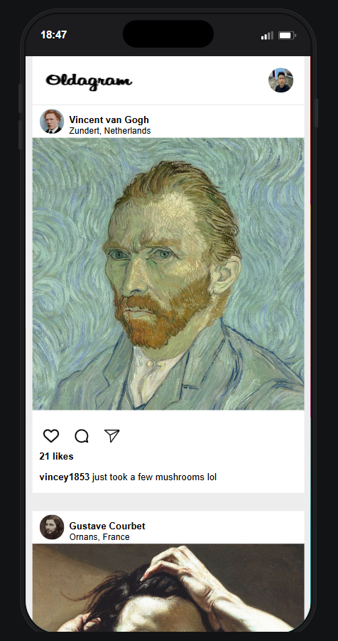

# Oldagram 🎨

Oldagram is a fun Instagram-inspired web application that imagines what social media might look like if famous historical artists had accounts.

Users can scroll through a feed featuring iconic artists, their artwork, humorous captions, and engagement statistics, all presented in a familiar social-media style interface.

## Features

* Dynamic post rendering with JavaScript
* Responsive Instagram-style layout
* Artist profile information
* Artwork posts with captions
* Like count display
* Clean and modern UI

## Built With

* HTML5
* CSS3
* JavaScript (ES6)

## What I Learned

While building this project, I practiced:

* Working with arrays of objects
* DOM manipulation
* Template literals
* JavaScript loops
* Dynamic HTML rendering
* Flexbox layouts
* Responsive design fundamentals

## Project Structure

```text
Oldagram/
│
├── index.html
├── index.css
├── index.js
│
└── images/
    ├── avatar-vangogh.jpg
    ├── avatar-courbet.jpg
    ├── avatar-ducreux.jpg
    ├── post-vangogh.jpg
    ├── post-courbet.jpg
    ├── post-ducreux.jpg
    └── ...
```

##

## Mobile Pre-view




## Getting Started

1. Clone the repository

```bash
git clone <your-repository-url>
```

2. Open the project folder

```bash
cd oldagram
```

3. Open `index.html` in your browser

No additional dependencies or installation required.

## Acknowledgements

This project was built as part of my frontend development learning journey and is inspired by the user experience of modern social media platforms.

## Author

Created by { Peter Paing }

Currently learning JavaScript and frontend development.
